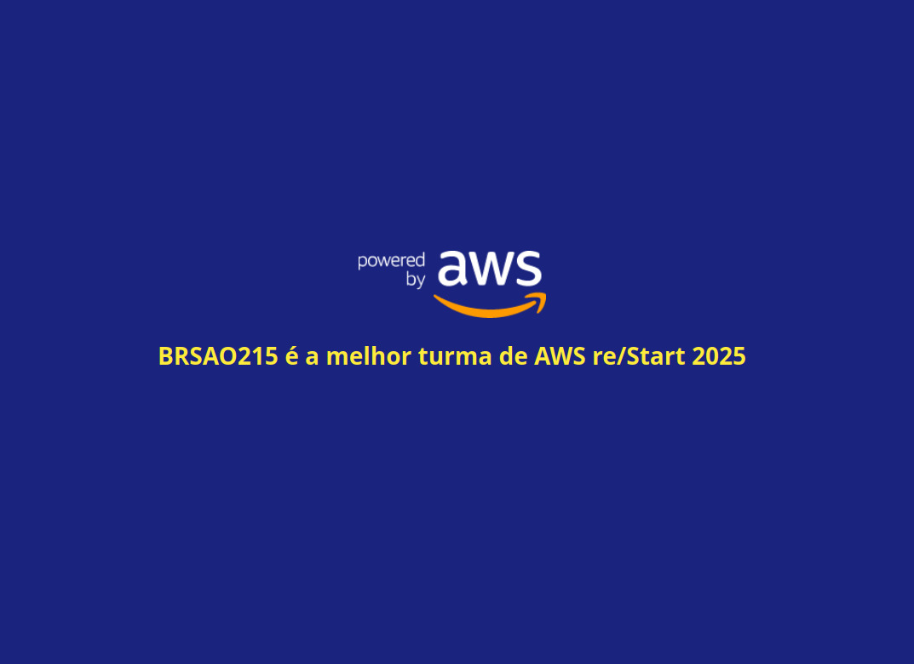
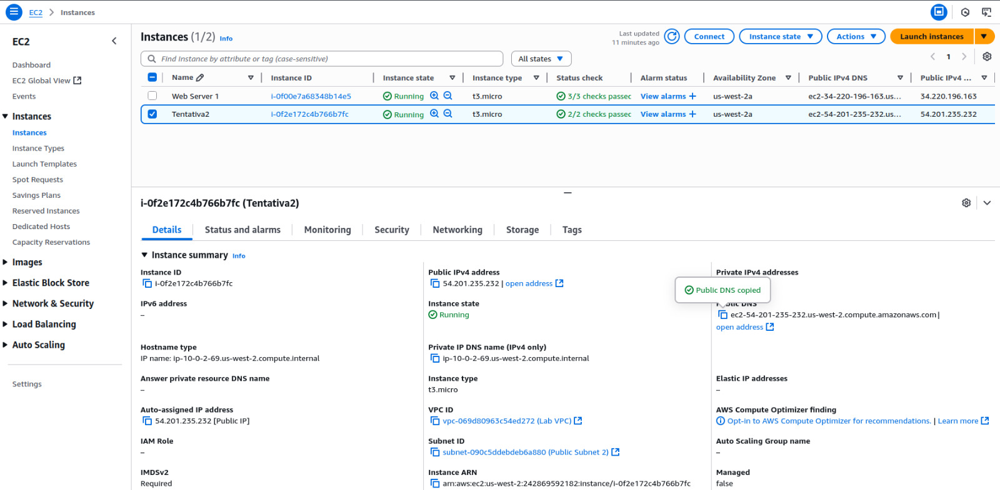
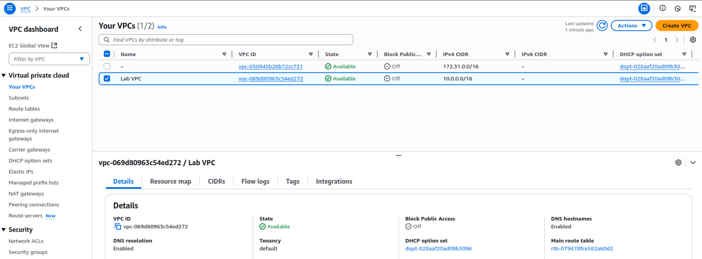

# Hands-on em Amazon Web Services (AWS): Criando uma VPC funcional e segura

## 🚀 O Desafio
Atuar como engenheira de suporte em um cenário simulado, ajudando uma startup com problemas de conectividade. O objetivo foi identificar erros e configurar uma VPC funcional com acesso externo via SSH.

## ⚙️ Atividades Realizadas
- Criação de uma **VPC personalizada**
- Configuração de **sub-rede pública**
- Adição de **Internet Gateway (IGW)**
- **Tabela de rotas** e associação à sub-rede
- Criação de uma **instância EC2** com acesso via SSH
- Testes de conectividade e troubleshooting

## 🧪 Prints da Solução

### 🔸 Print 1: Criação da VPC

---

### 🔸 Print 2: Tabela de Rotas e IGW

---

### 🔸 Print 3: EC2 em execução com acesso SSH

## 📄 Relatório
Veja o relatório completo em `relatorio.md` (arquivo ainda será criado)

## 🛠️ Tecnologias
- AWS EC2
- AWS VPC
- Linux (Ubuntu)
- Git / GitHub

## ✍️ Autora
Gabriela Ferraz
